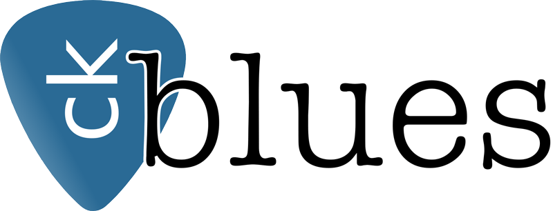

# Harvard CS50 Web Capstone: *CK Blues*
__By Chris Korsak__

April, 2021

## Project Overview

My Harvard CS50 Web capstone is called __*CK Blues*__. This is a web application that helps guitar players improve their playing. This website provides guitar lessons, backing tracks to jam with, and individual feedback. This application consists of a blog with both free and premium content. Users can sign up for an account to access premium content and also submit Youtube video links of themselves playing guitar for individual feedback.

#### Backstory

In 2013, I created some blues guitar backing tracks under the name of Ck Blues. For a short while, I had a simple wordpress blog to support the backing tracks and provide some guitar lessons. In the last few years I've wanted to create a new guitar lesson website from scratch. This is my implementation using all the knowledge I've learned from [Harvard CS50's](https://cs50.harvard.edu/web/2020/) Web Programming with Python and Javascript.

## Website Sections

### Login/Logout/Register
In order to access 'premium' content, the user has to register and log in to their account. Users will be asked to provide credentials to register and/or log in.
#### Login/Logout/Register Behavior
* When a user navigates to the registration page, they will be asked to provide a first name, last name, username, an email address, and a password (twice). The application will verify these inputs and redirect the user to a newly created user dashboard if successful.
* When a user navigates to the login page, they will be asked to provide a username and password. The application will verfiy these inputs and redirect to the user dashboard if successful.
* Clicking the logout link in the navigation will log the user out and redirect the user to the homepage.

### Blog
The main section of this website is a blog that is filled with content (both free and premium) to help improve guitar playing. Blog articles will consist of lessons, exercises, and backing tracks to solo over.
#### Blog Behavior
* When a user is not logged in, a welcome section will display at the top of the screen. This can be dismissed and never display again.
* When a user navigates to the homepage, the blog will be populated with a number of 'free' posts that do not require the user to log in.
* When a user is logged in, the blog will be populated with both 'free' and 'premium' content.
* Users can filter blog posts by category to more easily find content they are looking for (lessons, exercises, backing tracks).
* Blog posts will display only a title and a short excerpt on the main blog page.
* When a user clicks on a blog post title, the user will be taken to the blog post page where the entire post is displayed.
* Users will be able to comment on posts if logged in to the website. Previous comments will be displayed whether the user is logged in or not.
* Only 8 posts will display on a blog page, and pagination links to navigate to more posts will be displayed at the bottom of the page.

### Feedback
In this section of the website, users can submit a form which allows them to receive feedback (aka a critique) on their guitar playing. Users will submit a link to a youtube video of themselves playing a song, improvising, or using a playing technique they'd like feedback with.
#### Feedback Behavior
* When logged in, a link called *feedback* will be displayed in the site navigation section. If a user clicks on this link, they will be directed to the feedback submission page.
* The feedback submission page will display a form where the user can submit a youtube video link, select the video category from a dropdown menu (cover song, soloing, rhythm, improvisation, technique), and describe any questions or comments regarding their video submission.
* Successfully submitting a feedback form will redirect the user to a newly-created feedback page where their information is displayed.
* If a feedback has been reviewed, the page will also display a screencast video response from the administrator.
* A feedback page is private and can't be accessed by other users. It will have a comment section where dialogue between the user and administrator.

### User Dashboard
Users who are logged in will have a 'dashboard' which allows them to see their account details and their feedback submissions.
#### User Dashboard Behavior
* The dashboard will display a list of all feedbacks that have been submitted. Clicking on a feedback link will direct the user to a feedback page.
* Each feedback in the dashboard will have a review status so the user knows if there's a screencast critique ready.
* Users can update their email and/or password credentials via their dashboard. Updating an email address and/or password will log the user out and redirect them to the login page.

### Admin
This utilizes the Django admin app in order to take care of site administration. Site administrators can create and publish blog posts, respond to user feedback submissions, and monitor comments.
### Admin Behavior
* Django models displayed in the Django admin app: (User, Post, PostComment, Feedback, FeedbackComment).
* Posts have access to a rich-text-editor (called ckeditor) for the text content section.

## Project Complexity
I believe this project satisfies the complexity requirements and is disinct from the previous class projects for the following reasons:

* This application is a blog-style website with both free and premium content, which is a structure we have not attempted in the class.
* This project uses five Django models for keeping track of data. This is a more complex database than any project I've created in this class.
* Because blog post content can be diverse, a user-friendly way to create this content is needed. I have installed a rich text editor package called [*ckeditor*](https://github.com/django-ckeditor/django-ckeditor) to achieve this.
* This application uses a combination of custom CSS media queries and [Bootstrap](https://getbootstrap.com/) to be responsive to all screen-sizes.

## Notable files and directories in addition to the default Django project files

* `/ckblues` - app directory
  * `/static/ckblues` - directory of all static files
    * `/images` - directory of all website images
    * `scripts.js` - javascript file for user dashboard interface behavior
    * `scripts2.js` - javascript file for homepage welcome message behavior
    * `styles.css` - cascading style sheet for site
  * `/templates/ckblues` - directory of all html website templates
    * `404.html, category.html, dashboard.html, feedback-form.html, feedback.html, index.html, layout.html, login.html, post.html, register.html` - html template files
  * `admin.py` - django models registered with admin app
  * `models.py` - django database models
  * `urls.py` - url patterns for application
  * `views.py` - django/python views/functions that are associated with application urls.
* `.gitignore` - list of files to not be tracked by git
* `db.sqlite3` - the database file

## Technologies Used
* Django (Python)
* HTML
* CSS and Bootstrap
* Javascript

## How To Run This Application

* Terminal: $ git clone https://github.com/chriskorsak/capstone.git
* Terminal: $ pip install -r requirements.txt
* Terminal: $ python3 manage.py runserver
